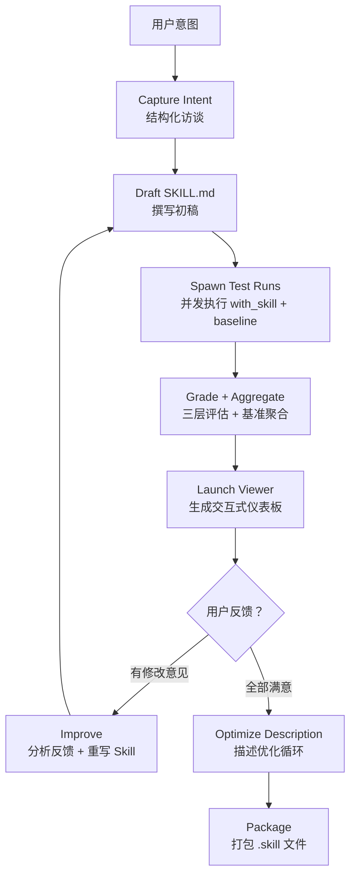
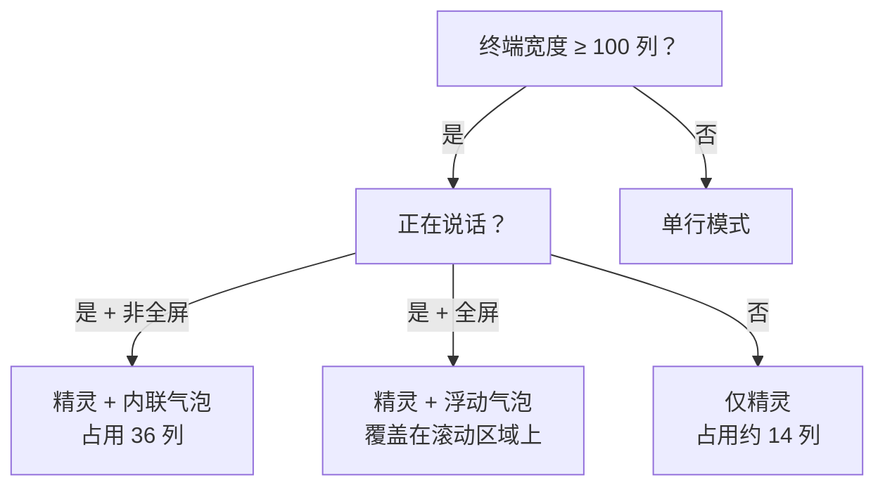
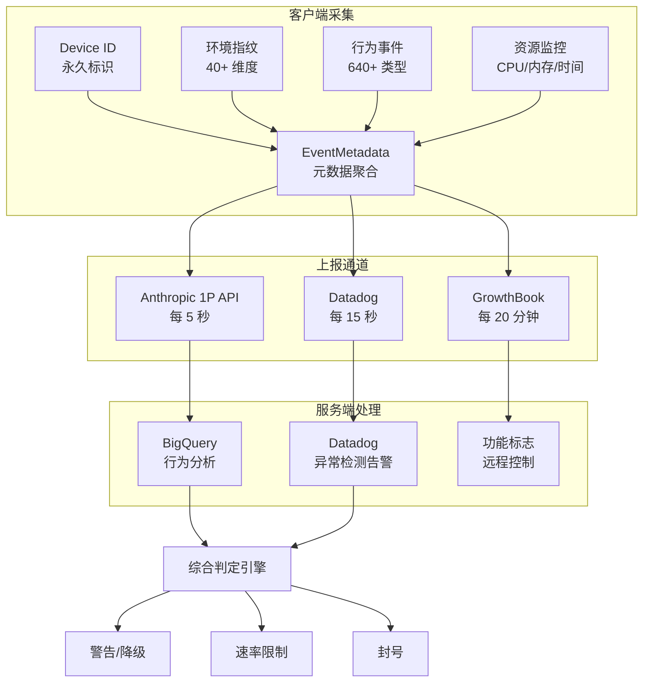
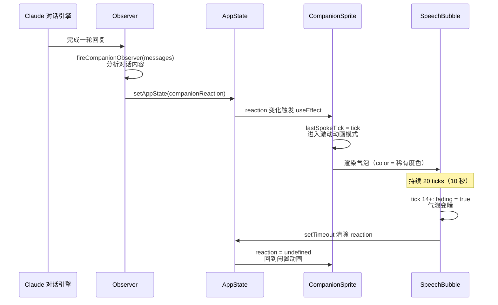
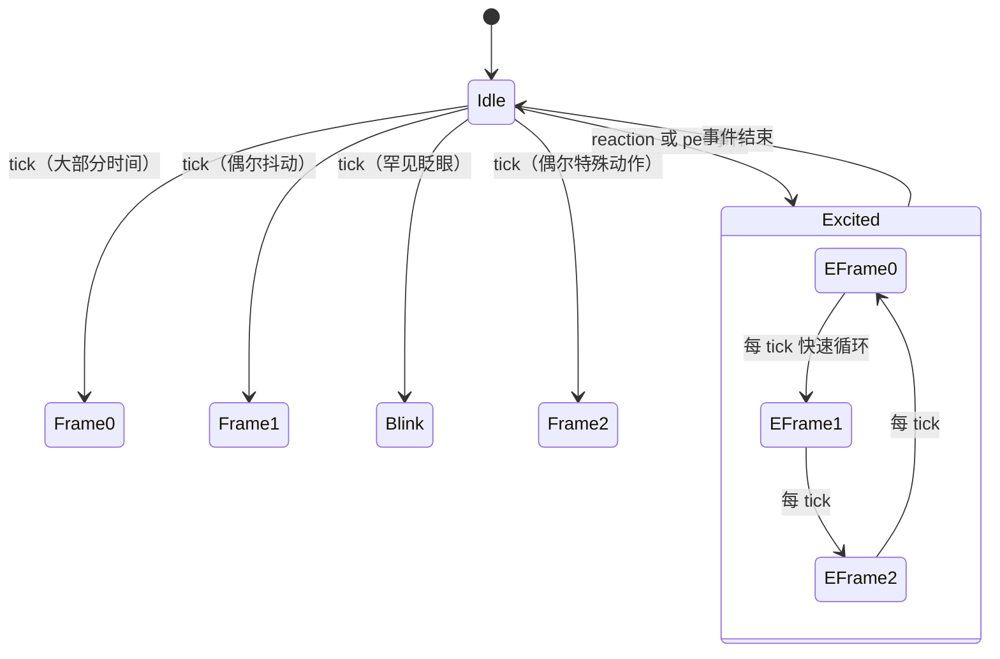
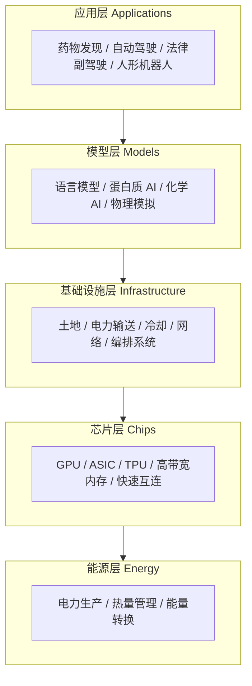
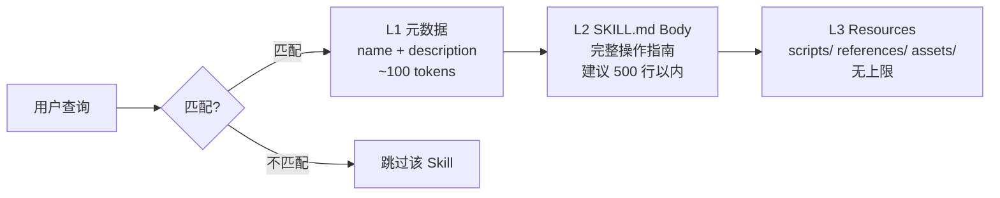

# 技术图表绘制 Skill

本 Skill 总结了公众号"中国人本来就聪明"17 篇技术文章中使用的全部视觉元素风格，提供可复用的图表绘制规范。

## 1. 设计哲学

该公众号的视觉设计遵循三条核心原则：

1. **信息密度优先**：每个视觉元素都承载不可被纯文字替代的信息。不为美观而加图，只为理解而加图。
2. **Mermaid + Markdown 原生**：所有图表均使用 Mermaid 语法或 Markdown 表格，不依赖外部设计工具（Figma、Draw.io 等），保证在微信公众号、博客、飞书等多平台的一致渲染。
3. **渐进式信息披露**：复杂系统先用一张总览图给出全局认知，再用分区域的详细图展开。读者可以只看总览图就获得 80% 的理解。

## 2. 六种核心视觉元素

### 2.1 数据对比表格（使用频率最高）

几乎每篇文章都使用 Markdown 表格进行多维度对比。表格是该公众号最核心的视觉工具。

**设计规范**：

- 列数控制在 3-6 列，超过 6 列拆分为多张表
- 第一列为对比维度/名称，后续列为被比较的对象
- 数值型数据右对齐，文字型数据左对齐
- 关键数据用**加粗**突出
- 表头使用简洁的中文标签，必要时括号注释英文原名

**典型用法 1：基准测试对比表**（出自 Anthropic Mythos 文章）

```markdown
| 基准测试 | Mythos Preview | Opus 4.6 | GPT-5.4 | Gemini 3.1 Pro |
|----------|---------------|----------|---------|---------------|
| SWE-bench Verified | **93.9%** | 80.8% | — | 80.6% |
| SWE-bench Pro | **77.8%** | 53.4% | 57.7% | 54.2% |
| USAMO 2026 | **97.6%** | 42.3% | 95.2% | 74.4% |
| GPQA Diamond | **94.5%** | 91.3% | 92.8% | 94.3% |
| HLE (with tools) | **64.7%** | 53.1% | 52.1% | 51.4% |
```

**典型用法 2：概念对比表**（出自 Harness Engineering 文章）

```markdown
| 阶段 | 核心问题 | 类比 |
|------|---------|------|
| Prompt Engineering | 怎么把一句话说清楚 | 写一封信 |
| Context Engineering | 怎么把必要信息喂进去 | 准备一份档案 |
| Harness Engineering | 怎么把整个环境搭成系统 | 建一座工厂 |
```

**典型用法 3：功能/特性对比表**（出自 Claude Code Buddy 文章）

```markdown
| 稀有度 | 星级 | 主题色 | 帽子 | 属性下限 |
|--------|------|--------|------|---------|
| Common | ★ | 灰色 | 无 | 5 |
| Uncommon | ★★ | 绿色 | 随机 | 15 |
| Rare | ★★★ | 蓝色 | 随机 | 25 |
| Epic | ★★★★ | 黄绿色 | 随机 | 35 |
| Legendary | ★★★★★ | 金色 | 随机 | 50 |
```

**典型用法 4：风险等级表**（出自封号机制文章）

```markdown
| 排名 | 原因 | 风险等级 | 说明 |
|------|------|---------|------|
| 1 | 订阅滥用/共享账号 | 极高 | Device ID 跨设备关联 |
| 2 | 速率限制违规 | 高 | 超出 rateLimitTier 配额 |
| 3 | 内容策略违规 | 高 | 消息内容指纹 + anti-distillation |
```

### 2.2 Mermaid 流程图

用于展示系统工作流程、决策逻辑、数据流向。

**设计规范**：

- 使用 `graph TD`（从上到下）或 `graph LR`（从左到右），根据流程的长短选择方向
- 节点文字控制在 2-8 个汉字或 3-15 个英文单词
- 条件分支用菱形节点，操作步骤用圆角矩形
- 颜色用于区分不同的功能域或状态，不要超过 4 种颜色
- 箭头上的标签用于说明转换条件

**典型用法 1：系统架构总览**（出自 skill-creator 拆解文章）



**典型用法 2：决策流程图**（出自 Claude Code Buddy 文章）



**典型用法 3：数据流图**（出自封号机制文章）



### 2.3 Mermaid 序列图

用于展示多个参与者之间的时序交互。

**设计规范**：

- 参与者数量控制在 3-6 个
- 用 `activate`/`deactivate` 标注活跃时间段
- 循环和条件用 `loop`/`alt`/`opt` 块
- 注释用 `Note` 标注关键状态变化

**典型用法**（出自 Claude Code Buddy 文章的气泡生命周期）：



### 2.4 Mermaid 状态机图

用于展示系统状态转换逻辑。

**设计规范**：

- 状态用简洁名词，不超过 3 个词
- 转换条件标注在箭头上
- 初始状态和终止状态明确标注

**典型用法**（出自 Claude Code Buddy 文章的动画状态机）：



### 2.5 层级结构图（分层蛋糕图）

用于展示系统的层级架构。由于 Mermaid 对层级结构的表达有限，通常使用以下两种替代方式。

**方式 1：文字 + 箭头链**

```
Energy → Chips → Infrastructure → Models → Applications
能源   → 芯片 →   基础设施     → 模型  →    应用
```

**方式 2：Mermaid 子图嵌套**



**方式 3：渐进式加载层级**（出自 Agent 超级进化文章）



### 2.6 ASCII 图解

用于在纯文本环境中表达简单的结构关系，或展示终端交互效果。

**设计规范**：

- 使用等宽字体渲染
- 箭头用 `→`、`←`、`↑`、`↓`
- 方框用 `[ ]`、`( )`、`{ }`
- 树结构用 `├──`、`└──`、`│`

**典型用法 1：目录树**

```
wiki-root/
├── CLAUDE.md              # Schema：定义 wiki 结构和工作流
├── raw/                   # 第一层：不可变的原始资料
│   ├── articles/
│   ├── papers/
│   └── data/
├── wiki/                  # 第二层：LLM 维护的 Wiki
│   ├── index.md
│   ├── entities/
│   ├── concepts/
│   └── comparisons/
└── assets/                # 图片、图表
```

**典型用法 2：ASCII 艺术（终端效果展示）**

```
帧 0（静止）      帧 1（微动）      帧 2（特殊）
   /\_/\            /\_/\            /\-/\
  ( ·   ·)         ( ·   ·)         ( ·   ·)
  (  ω  )          (  ω  )          (  ω  )
  (")_(")          (")_(")~         (")_(")
                   ^尾巴甩           ^耳朵抖
```

## 3. 组合模式

### 3.1 表格 + 流程图组合

最常见的组合方式。先用表格列出静态的分类/对比数据，再用流程图展示动态的工作流程。

**示例**（出自 skill-creator 拆解文章）：
- 先用表格对比"手写 Skill vs skill-creator 造 Skill"的 6 个维度
- 再用流程图展示 Draft-Test-Evaluate-Improve 闭环

### 3.2 总览图 + 模块表组合

先用一张 Mermaid 图给出系统全貌，再用多张表格拆解每个模块的细节。

**示例**（出自 Claude Code Buddy 文章）：
- 先用流程图展示"用户输入 → 命令处理器 → 确定性生成 → Claude API → 持久化 → 渲染"的完整链路
- 再用表格分别列出：18 种物种图鉴、稀有度体系、五维属性、交互命令、源码文件清单

### 3.3 数据表 + 公式/代码组合

表格展示数据，代码块展示实现细节或计算公式。

**示例**（出自 ARK Big Ideas 文章）：
- 表格列出 AI 推理成本的历史数据点
- 代码块/公式展示成本下降的计算方式

## 4. 排版规范

### 4.1 标题层级

- `#` 一级标题：文章标题（仅一个）
- `##` 二级标题：大章节（如"一、核心结论"、"二、身份追踪体系"）
- `###` 三级标题：子章节
- `####` 四级标题：极少使用，仅在嵌套很深的结构中

### 4.2 强调与标注

- **加粗**：关键结论、核心数据、重要术语首次出现
- *斜体*：英文术语的中文翻译注释
- `代码字体`：技术名词、命令、API 名称、文件路径
- > 引用块：原文引用（英文原文 + 中文翻译）、重要人物的评价
- Callout 块：`Important`（关键结论）、`Warning`（风险提示）、`Tip`（实用建议）

### 4.3 段落节奏

- 每段不超过 5 行（微信公众号的阅读体验要求）
- 数据密集段落后紧跟 1-2 行的解读/评论
- 长列表使用有序列表，特征列表使用无序列表
- 代码块前后各空一行

### 4.4 数据呈现规则

- 百分比保留一位小数（如 93.9%）
- 金额使用 `$` 或 `¥` 前缀，大数字用 `万`/`亿` 或 `K`/`M`/`B` 后缀
- 倍数关系用 `X 倍` 表达（如"成本差了 50 多倍"）
- 对比数据尽量放在同一张表中，而非分散在文字里

## 5. 绘图指令模板

### 5.1 当用户说"画一个架构图"

```
1. 确认要表达的系统边界和核心模块
2. 选择合适的 Mermaid 图类型（graph TD/LR、sequenceDiagram、stateDiagram）
3. 先画 3-5 个核心节点的骨架
4. 添加子模块和连接关系
5. 用 subgraph 分组相关模块
6. 如果模块超过 15 个，考虑拆分为多张图
```

### 5.2 当用户说"做一个对比"

```
1. 确认对比维度（3-6 个）
2. 确认被对比的对象（2-5 个）
3. 用 Markdown 表格组织数据
4. 关键差异用加粗标出
5. 表格下方用 1-2 行文字点评最关键的发现
```

### 5.3 当用户说"画一个流程"

```
1. 确认起点和终点
2. 列出中间的关键步骤（5-10 步为宜）
3. 识别分支条件（if/else）
4. 用 Mermaid graph TD 绘制
5. 分支路径用不同的箭头标签标注条件
6. 如有并发步骤，用 subgraph 分组
```

### 5.4 当用户说"画一个时序图"

```
1. 确认参与者（3-6 个）
2. 按时间顺序列出交互步骤
3. 用 Mermaid sequenceDiagram 绘制
4. 关键状态变化用 Note 标注
5. 循环/条件用 loop/alt 块包裹
```

## 6. 风格禁忌

- **不要**在 Mermaid 中使用 `\n` 换行，使用 `<br/>` 代替
- **不要**让表格超过 8 列，超过就拆分
- **不要**在图表中堆砌超过 20 个节点，超过就分层展示
- **不要**使用纯装饰性的图表（如没有信息量的 logo 拼贴）
- **不要**在同一张图中混合中英文节点名（保持一致性）
- **不要**用图片代替可以用 Mermaid 表达的图表（保持可编辑性）
- **不要**在 Callout 中使用超过 3 行的文字（保持简洁）
